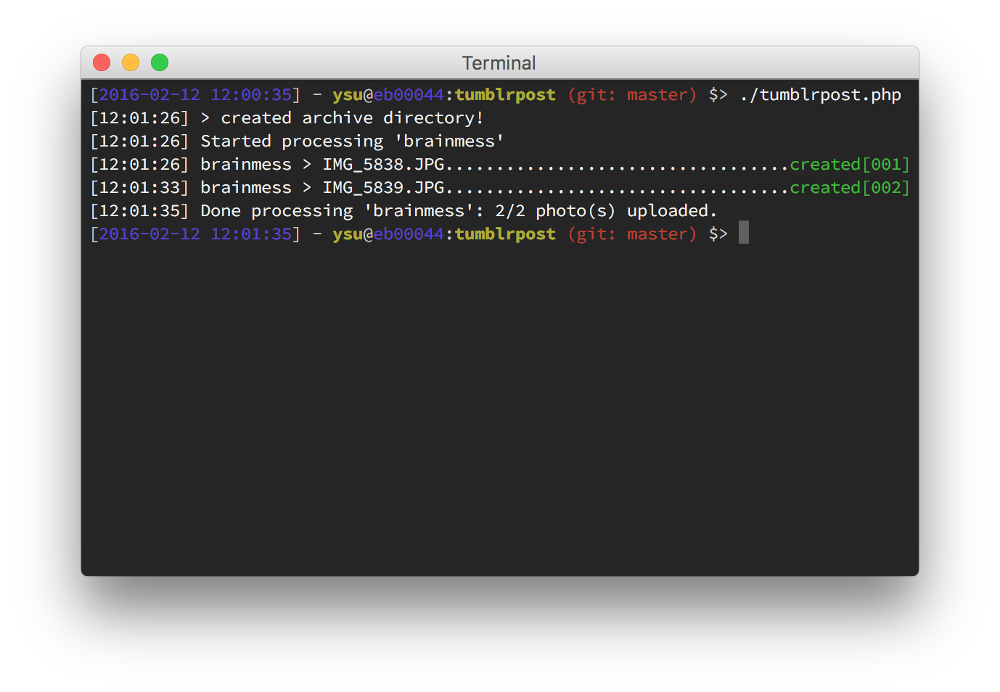

  

# TumblrPoster

Enables batch upload of photos on a [Tumblr](http://www.tumblr.com/) blog using the [official API](http://www.tumblr.com/api/).

## Usage

### Basic

* Place the photos you want to upload in the `photos` directory
* Open a terminal pointed at the script folder
* Make sure the script is executable (`chmod +x`)

Then run:

	./tumblrpost.php

### Advanced
Several options are available, for detailed help and usage examples run the following command:

	./tumblrpost.php -h (or --help)
	
Output:

	Usage: ./tumblrpost.php

	  -q (or --queued)           *optional* a flag to tell the script to put the post in queue (default is 'published')
	  -h (or --help)             prints this help
	
	Examples:
	
	  ./tumblrpost.php           (post every photo available)
	  ./tumblrpost.php --queued  (post every photo in the blog queue)
	
	Notes:
	
	 - photos are taken from the 'photos' directory where the script resides
	 - configuration resides in the config.json file

## Configuration

In order for the script to work you need to register an app on the [Tumblr API](http://www.tumblr.com/oauth/apps) (it only takes seconds) and then rename the `config-example.json` to `config.json` and replace the values:

* CONSUMER_KEY
* CONSUMER_SECRET
* OAUTH_TOKEN
* OAUTH_SECRET

Also change the name of your blog:

* BLOG_NAME
	
Change `brainmess` with the name of your blog (`xxxxxx`.tumblr.com).